# 🚗 Smart Parking System Using Ultrasonic Sensors

A real-time embedded parking management system that automatically detects parking-slot occupancy using ultrasonic sensors, calculates available parking spaces, and provides visual and audio status alerts.

The complete four-slot prototype is implemented and tested virtually using **Wokwi with Arduino UNO**.

---

## 👨‍💻 Author

**Adarsh Srivastav**
Computer Science and Engineering (CSE) Student
Embedded Systems | IoT | Python | AI

---

## 📌 Project Overview

The **Smart Parking System** is an embedded-system project designed to automate parking-slot monitoring.

The system uses **four HC-SR04 ultrasonic sensors**, with each sensor assigned to an individual parking slot. The Arduino UNO continuously measures the distance detected by each sensor and classifies the corresponding slot as **FREE** or **OCCUPIED** based on a configurable distance threshold.

The number of available parking slots is calculated in real time and displayed on a **16×2 I2C LCD**.

* 🟢 Green LED → Parking space available
* 🔴 Red LED → All parking slots occupied
* 🔊 Buzzer → Parking full alert

The complete system was designed, implemented, and tested virtually using **Wokwi**, providing practical experience in sensor interfacing, Embedded C/C++ programming, GPIO control, LCD interfacing, real-time decision making, debugging, and virtual hardware simulation.

---

## 🎯 Objectives

* Automatically detect parking-slot occupancy.
* Monitor four parking slots simultaneously.
* Measure distance using HC-SR04 ultrasonic sensors.
* Classify parking slots as FREE or OCCUPIED.
* Calculate the total number of available slots.
* Display parking availability on an I2C LCD.
* Provide visual parking-status indication.
* Generate an audio alert when parking is full.
* Demonstrate embedded-system design using Arduino UNO.
* Validate the complete system using Wokwi virtual simulation.

---

## ✨ Key Features

* Four-slot automated parking detection
* Four HC-SR04 ultrasonic sensors
* Real-time distance measurement
* Configurable **20 cm occupancy threshold**
* Automatic FREE/OCCUPIED classification
* Available-slot counting
* 16×2 I2C LCD display
* Green LED availability indication
* Red LED parking-full indication
* Buzzer-based full-capacity alert
* Serial Monitor debugging
* Wokwi virtual hardware simulation
* Modular and expandable embedded architecture

---

## 🏗️ System Architecture

```text
                         SMART PARKING SYSTEM
                                  │
                                  ▼
                       ┌─────────────────────┐
                       │     Arduino UNO     │
                       │   Central Control   │
                       └──────────┬──────────┘
                                  │
              ┌───────────────────┼───────────────────┐
              │                   │                   │
              ▼                   ▼                   ▼
       HC-SR04 Sensors     Distance Processing    Output Control
              │                   │                   │
              │                   ▼             ┌─────┼─────┐
              │             FREE/OCCUPIED       │     │     │
              │                   │              ▼     ▼     ▼
              ▼                   ▼             LCD   LEDs  Buzzer
        Slot Detection      Available Slots
```

---

## 🔄 Working Principle

Each HC-SR04 ultrasonic sensor monitors one parking slot.

```text
Ultrasonic Sensor
       ↓
Transmit Ultrasonic Pulse
       ↓
Receive Reflected Echo
       ↓
Measure Echo Duration
       ↓
Calculate Distance
       ↓
Compare With Threshold
       ↓
FREE / OCCUPIED
       ↓
Count Available Slots
       ↓
Update LCD + LED + Buzzer
```

### Parking Detection Logic

The prototype uses a **20 cm threshold**.

```text
Distance < 20 cm
       ↓
   OCCUPIED


Distance >= 20 cm
       ↓
      FREE
```

The 20 cm value is the default threshold used in the prototype and can be calibrated for a real parking installation.

---

## 📐 Distance Calculation

The system calculates distance using the ultrasonic echo time:

```text
Distance = (Echo Time × Speed of Sound) / 2
```

The implementation uses approximately:

```text
Speed of Sound = 0.0343 cm/µs
```

The division by two is required because the ultrasonic pulse travels from the sensor to the object and back to the sensor.

---

## 🔌 Hardware Components

| Component                 |    Quantity | Purpose                      |
| ------------------------- | ----------: | ---------------------------- |
| Arduino UNO               |           1 | Main microcontroller         |
| HC-SR04 Ultrasonic Sensor |           4 | Parking-slot detection       |
| 16×2 I2C LCD              |           1 | Available-slot display       |
| Green LED                 |           1 | Parking available indication |
| Red LED                   |           1 | Parking full indication      |
| Buzzer                    |           1 | Parking-full alert           |
| 220Ω Resistor             |           2 | LED current limiting         |
| Breadboard                |           1 | Circuit prototyping          |
| Jumper Wires              | As required | Circuit connections          |

---

## 💻 Software & Tools

* **Programming Language:** Embedded C/C++
* **Microcontroller:** Arduino UNO
* **Simulation:** Wokwi
* **Development Environment:** Visual Studio Code
* **Build Environment:** PlatformIO
* **Display Library:** LiquidCrystal_I2C
* **Version Control:** Git
* **Repository:** GitHub

---

## 📍 Pin Configuration

| Component   | Arduino UNO Pin |
| ----------- | --------------- |
| Slot 1 TRIG | D2              |
| Slot 1 ECHO | D3              |
| Slot 2 TRIG | D4              |
| Slot 2 ECHO | D5              |
| Slot 3 TRIG | D6              |
| Slot 3 ECHO | D7              |
| Slot 4 TRIG | D8              |
| Slot 4 ECHO | D9              |
| Green LED   | D10             |
| Red LED     | D11             |
| Buzzer      | D12             |
| LCD SDA     | A4              |
| LCD SCL     | A5              |
| VCC         | 5V              |
| GND         | GND             |

---

## 🖥️ LCD Output

### Parking Available

```text
┌────────────────┐
│ Available: 4   │
│ Slots Available│
└────────────────┘
```

### Parking Full

```text
┌────────────────┐
│ Available: 0   │
│ PARKING FULL   │
└────────────────┘
```

---

## 🚦 Status Indication

| Parking Condition      | Green LED | Red LED | Buzzer |
| ---------------------- | --------- | ------- | ------ |
| At least one slot free | ON        | OFF     | OFF    |
| All slots occupied     | OFF       | ON      | ON     |

---

## 🧪 Testing

The system was tested using different virtual sensor-distance conditions in Wokwi.

| Test Case      | Slot 1 | Slot 2 | Slot 3 | Slot 4 | Available Slots | Result |
| -------------- | -----: | -----: | -----: | -----: | --------------: | ------ |
| All slots free |  30 cm |  30 cm |  30 cm |  30 cm |               4 | PASS   |
| One occupied   |  10 cm |  30 cm |  30 cm |  30 cm |               3 | PASS   |
| Two occupied   |  10 cm |  10 cm |  30 cm |  30 cm |               2 | PASS   |
| Three occupied |  10 cm |  10 cm |  10 cm |  30 cm |               1 | PASS   |
| All occupied   |  10 cm |  10 cm |  10 cm |  10 cm |               0 | PASS   |
| Vehicle leaves |  10 cm |  10 cm |  30 cm |  10 cm |               1 | PASS   |

---

## 📊 Sample Serial Monitor Output

### All Slots Free

```text
Parking Slot Status
-------------------
Slot 1: 29.05 cm - FREE
Slot 2: 29.05 cm - FREE
Slot 3: 29.05 cm - FREE
Slot 4: 29.05 cm - FREE
-------------------
Available Slots: 4
```

### Parking Full

```text
Parking Slot Status
-------------------
Slot 1: 12.01 cm - OCCUPIED
Slot 2: 12.01 cm - OCCUPIED
Slot 3: 12.13 cm - OCCUPIED
Slot 4: 9.09 cm - OCCUPIED
-------------------
Available Slots: 0
```

---

## 📸 Project Screenshots

### 🔧 Complete Wokwi Circuit

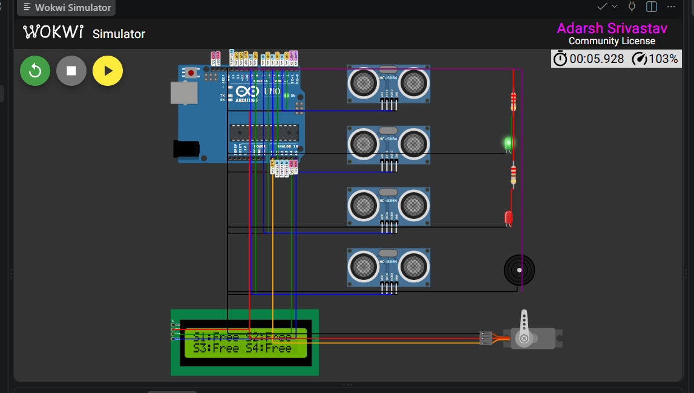

### 📁 Project Structure

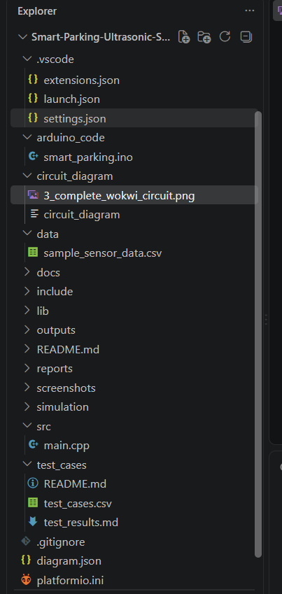

### 🛠️ PlatformIO Build Success

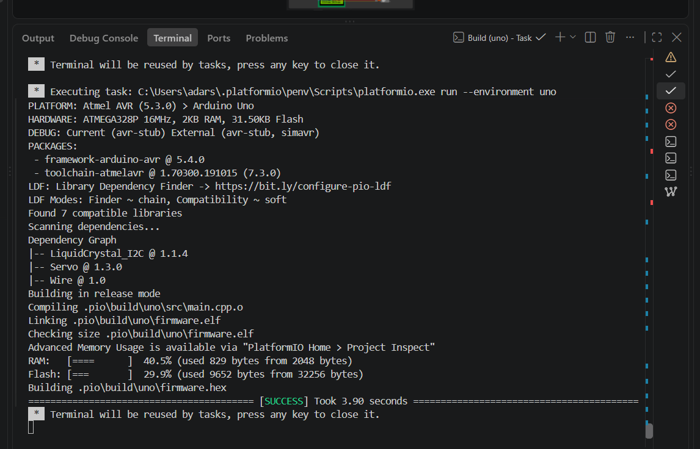

### 🟢 All Parking Slots Free

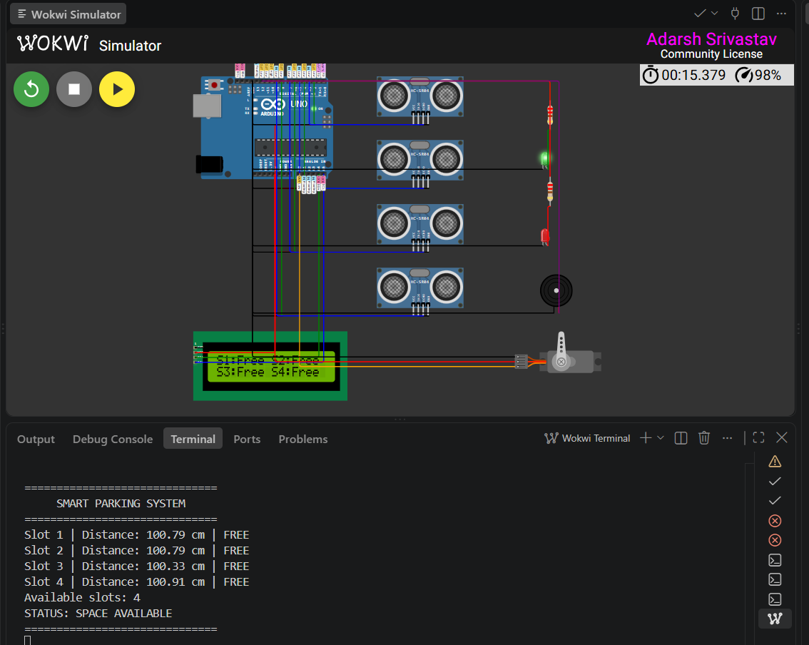

### 🚗 One Parking Slot Occupied

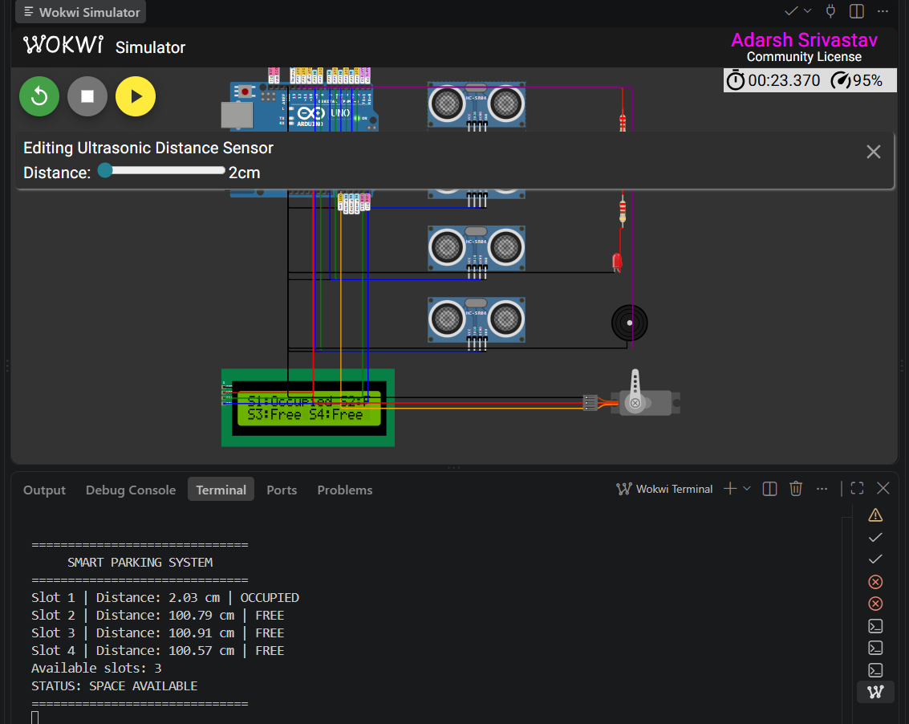

### 🚗🚗 Two Parking Slots Occupied

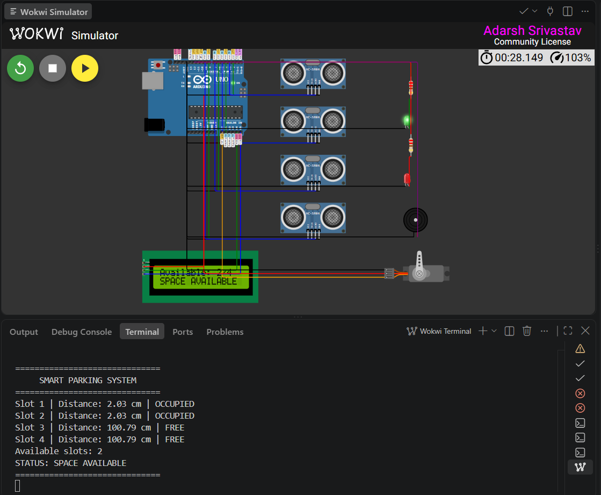

### 🚗🚗🚗 Three Parking Slots Occupied

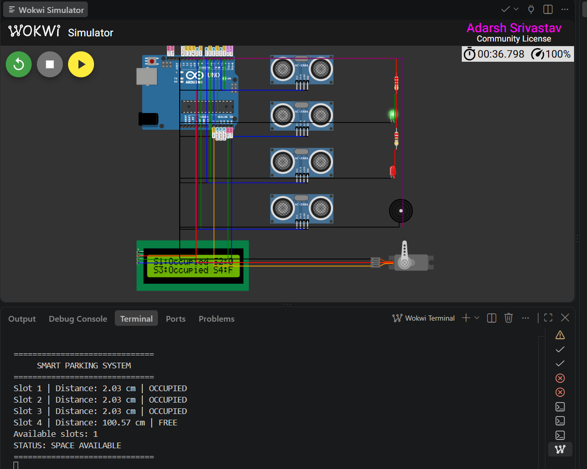

### 🚨 Parking Full

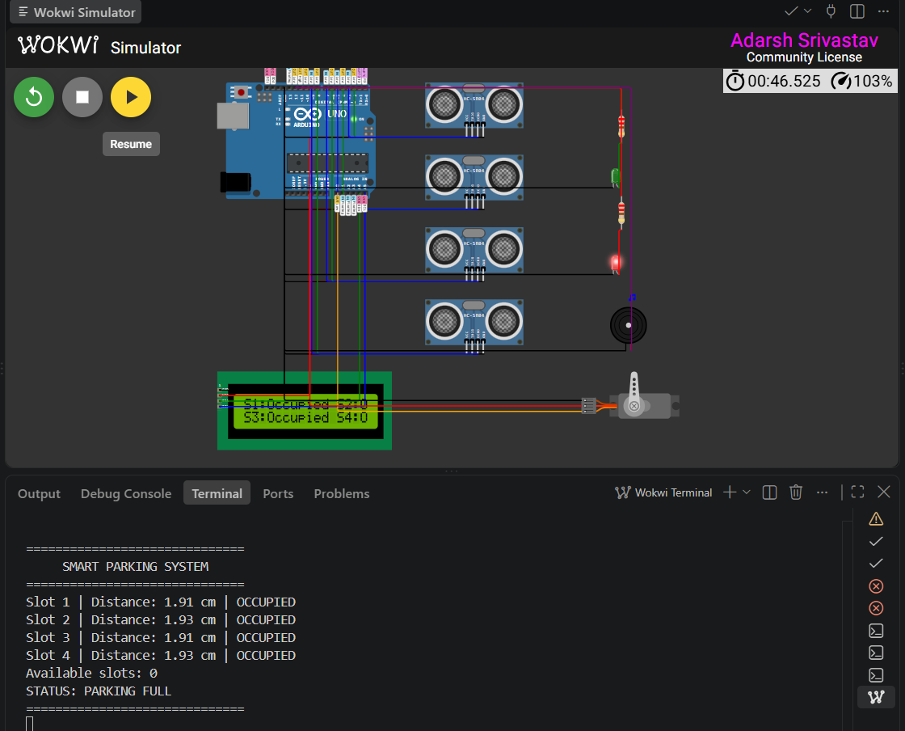

### 🟢 Green LED

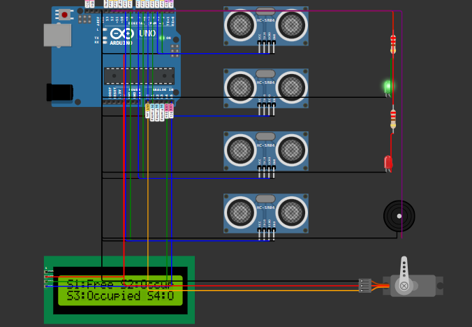

### 🔴 Red LED

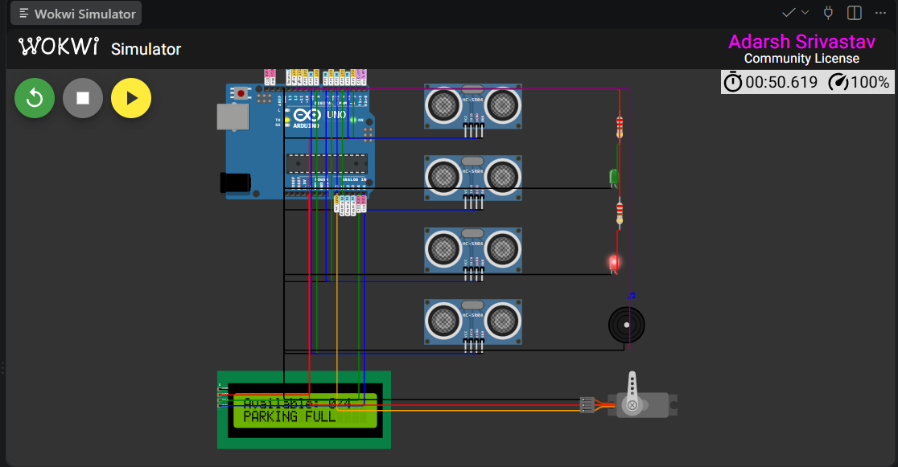

### 🖥️ LCD Status

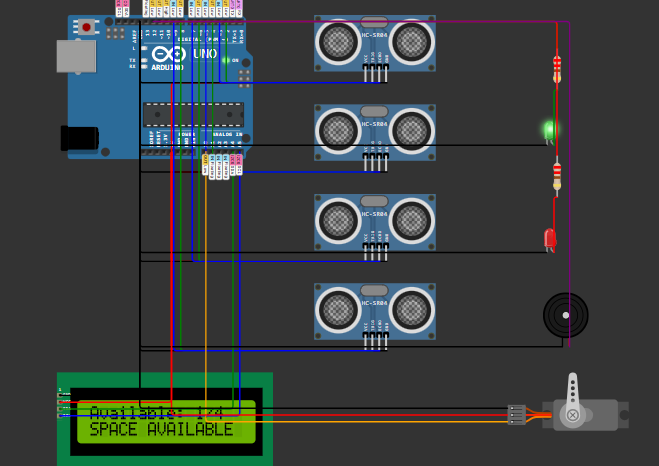

### 🔊 Buzzer Alert


### 📟 Serial Monitor

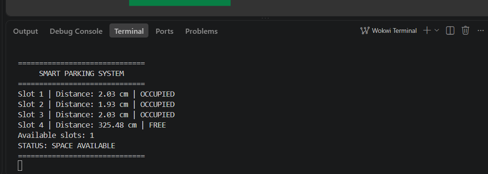

---

## 📂 Project Structure

```text
Smart-Parking-Ultrasonic-Sensor-System/
│
├── arduino_code/
│   └── smart_parking.ino
│
├── circuit_diagram/
│   └── circuit_diagram
│
├── data/
│   └── sample_sensor_data.csv
│
├── outputs/
│   ├── final_result.txt
│   ├── parking_status.txt
│   ├── serial_output.txt
│   └── test_results.csv
│
├── reports/
│   └── project_report
│
├── screenshots/
│   ├── 1_project_structure.png
│   ├── 2_platformio_build_success.png
│   ├── 3_complete_wokwi_circuit.png
│   ├── 4_all_slots_free.png
│   ├── 5_slot1_occupied.png
│   ├── 6_two_slots_occupied.png
│   ├── 7_three_slots_occupied.png
│   ├── 8_parking_full.png
│   ├── 9_green_led.png
│   ├── 10_red_led.png
│   ├── 11_lcd_status.png
│   ├── 12_buzzer.png
│   └── 13_serial_monitor.png
│
├── src/
│   └── main.cpp
│
├── test_cases/
│   └── README.md
│
├── .gitignore
├── README.md
├── diagram.json
├── platformio.ini
└── wokwi.toml
```

---

## 🛠️ Implementation Workflow

```text
Project Planning
      ↓
Circuit Design
      ↓
Single Ultrasonic Sensor Testing
      ↓
FREE/OCCUPIED Detection
      ↓
Four-Slot Integration
      ↓
Available Slot Counter
      ↓
LCD Integration
      ↓
LED Indication
      ↓
Buzzer Alert
      ↓
Wokwi Simulation
      ↓
Testing & Validation
      ↓
Documentation
      ↓
GitHub Deployment
```

---

## ▶️ How to Run the Project

### Wokwi Simulation

1. Open the project in VS Code.
2. Open the Wokwi simulation.
3. Load the Arduino UNO circuit.
4. Open the Arduino source code.
5. Start the simulation.
6. Select an HC-SR04 sensor.
7. Change its simulated distance.
8. Observe the Serial Monitor.
9. Observe the LCD, LEDs, and buzzer behavior.

### VS Code + PlatformIO

1. Clone the repository.
2. Open the project folder in VS Code.
3. Install the PlatformIO extension.
4. Open the project.
5. Build the project using PlatformIO.
6. Connect an Arduino UNO if physical hardware is available.
7. Select the correct COM port.
8. Upload the program.
9. Open Serial Monitor at 9600 baud.

---

## 📈 Results

The implemented prototype successfully:

* Detected four parking slots.
* Measured ultrasonic distance.
* Classified slots as FREE or OCCUPIED.
* Calculated available parking spaces.
* Displayed real-time availability on the LCD.
* Controlled green and red status LEDs.
* Activated the buzzer when parking was full.
* Handled simulated vehicles entering and leaving parking slots.
* Passed the defined virtual test cases.

---

## 🌐 Applications

The system can be used as a prototype for:

* Shopping mall parking
* Hospital parking
* Airport parking
* University and campus parking
* Office parking
* Residential parking
* Railway station parking
* Smart-city parking infrastructure

---

## ✅ Advantages

* Low-cost prototype
* Simple hardware architecture
* Real-time parking monitoring
* Automated slot detection
* Easy-to-understand embedded logic
* Reduced manual monitoring
* Easy expansion to additional parking slots
* Suitable for IoT integration
* Fully testable using virtual simulation

---

## ⚠️ Limitations

* Current prototype supports four parking slots.
* Ultrasonic readings depend on sensor placement.
* Physical deployment requires threshold calibration.
* The current prototype does not include cloud connectivity.
* No mobile application is implemented.
* No automatic barrier gate is implemented.
* No RFID or license-plate recognition is implemented.
* The current LED design provides overall parking status rather than individual LED pairs for every slot.

---

## 🚀 Future Scope

The project can be extended with:

* ESP32-based Wi-Fi connectivity
* IoT cloud dashboard
* Mobile application
* Real-time web dashboard
* Individual slot LED indicators
* Automatic servo-controlled parking barrier
* RFID-based vehicle identification
* Online parking reservation
* Digital payment integration
* License-plate recognition
* Cloud-based parking analytics
* Smart-city parking integration
* Database-backed parking history

---

## 🎓 Skills Demonstrated

### Embedded Systems

* Microcontroller programming
* GPIO interfacing
* Sensor interfacing
* Real-time control
* Hardware-software integration

### Electronics

* Ultrasonic sensing
* Digital input/output
* LED interfacing
* Buzzer interfacing
* I2C communication

### Programming

* C/C++
* Conditional logic
* Arrays
* Functions
* Sensor data processing
* Serial communication

### Tools

* Visual Studio Code
* PlatformIO
* Wokwi
* Git
* GitHub

---

## 💼 Industry Relevance

This project demonstrates the ability to develop a complete embedded prototype from requirements through implementation and testing.

It combines:

* Sensor interfacing
* Microcontroller programming
* Real-time decision making
* Hardware control
* Virtual simulation
* Debugging
* Testing
* Documentation
* Version control

The architecture can serve as a foundation for larger **IoT and smart-city parking solutions**.

---

## 📚 Project Evidence

Project evidence and supporting files are organized into:

```text
screenshots/
outputs/
test_cases/
reports/
data/
circuit_diagram/
arduino_code/
```

---

## 🔬 Project Status

### ✅ Completed and Tested

The four-slot Smart Parking System has been implemented and successfully validated using **Wokwi virtual simulation**.

The project demonstrates functional parking-slot detection, available-slot counting, LCD status display, LED indication, buzzer alerts, and Serial Monitor output.

---

## 👨‍🎓 Author

**Adarsh Srivastav**

Computer Science and Engineering (CSE) Student

**Areas of Interest:**
Embedded Systems | IoT | AI | Python

---

## ⭐ Conclusion

The **Smart Parking System Using Ultrasonic Sensors** successfully demonstrates how ultrasonic sensing and embedded control can be combined to automate parking-slot monitoring.

The system provides:

* Real-time occupancy detection
* Available-slot counting
* LCD-based information display
* Visual parking-status indication
* Parking-full audio alerts
* Serial Monitor debugging
* Virtual Wokwi testing

The project provides a functional proof of concept that can be further developed into an **ESP32-based IoT smart parking platform** with cloud connectivity, mobile monitoring, automated access control, and intelligent parking analytics.

---

## ⭐ Project Highlights

```text
4 Parking Slots
4 HC-SR04 Ultrasonic Sensors
Arduino UNO
16×2 I2C LCD
Green LED
Red LED
Buzzer
20 cm Detection Threshold
Wokwi Simulation
PlatformIO
Embedded C/C++
Git & GitHub
```

---

**Project Status: ✅ Completed | 🧪 Tested in Wokwi | 🚀 Ready for GitHub**
