# 🚗 Smart Parking System Using Ultrasonic Sensors

> A real-time ESP32-based embedded and IoT parking management prototype that automatically detects parking-slot occupancy using ultrasonic sensors, calculates available parking capacity, provides local visual/audio feedback, controls a capacity-based servo gate, and serves a live web dashboard.

---

## 👨‍💻 Author

**Adarsh Srivastav**  
Computer Science and Engineering (CSE) Student  
Embedded Systems | IoT | Python | AI

---

## 📌 Project Overview

The **Smart Parking System Using Ultrasonic Sensors** is an embedded and IoT prototype designed to automate parking-slot monitoring for four parking spaces.

Each parking slot is monitored by an **HC-SR04 ultrasonic sensor**. The ESP32 continuously measures the distance detected by each sensor and classifies the corresponding slot as **FREE** or **OCCUPIED** using a configurable **35 cm detection threshold**.

The number of available parking spaces is calculated in real time and presented through multiple interfaces:

- 🖥️ SSD1306 OLED display
- 🟢 Green LED for FREE slots
- 🔴 Red LED for OCCUPIED slots
- 🔊 Buzzer for parking-full alert
- 🚧 SG90 servo for capacity-based gate control
- 🌐 ESP32-hosted HTTP web dashboard
- 📟 Serial Monitor debugging

The complete prototype was developed and validated virtually using **Wokwi** with **ESP32 and PlatformIO**, providing practical experience in ultrasonic sensing, GPIO control, I²C communication, PWM, state management, Wi-Fi networking, HTTP serving, embedded programming, debugging, testing, and technical documentation.

> **Project note:** The current project is a **functional virtual prototype**. Physical hardware validation has not been performed.

---

## 🎯 Objectives

- Automatically detect parking-slot occupancy.
- Monitor four parking slots simultaneously.
- Measure distance using HC-SR04 ultrasonic sensors.
- Classify slots as FREE or OCCUPIED.
- Calculate the total number of available slots.
- Display live parking information on an OLED.
- Provide individual visual slot indication.
- Generate an audio alert when parking is full.
- Demonstrate capacity-based servo gate control.
- Provide a browser-based parking dashboard through ESP32 Wi-Fi.
- Provide Serial Monitor debugging information.
- Validate the complete system through Wokwi simulation.
- Maintain professional documentation and reproducible testing.

---

## ✨ Key Features

- Four-slot automated parking detection
- Four HC-SR04 ultrasonic sensors
- ESP32 DevKit central controller
- Real-time distance measurement
- Configurable **35 cm occupancy threshold**
- Automatic FREE/OCCUPIED classification
- Available-slot counting
- SSD1306 OLED 128×64 display
- Four green LEDs for FREE indication
- Four red LEDs for OCCUPIED indication
- Parking-full buzzer alert
- Capacity-based SG90 servo gate
- ESP32 Wi-Fi connectivity
- Local HTTP web dashboard
- Serial Monitor debugging
- Wokwi virtual hardware simulation
- PlatformIO build system
- Modular and expandable embedded architecture

---

## 🏗️ System Architecture

```text
                         SMART PARKING SYSTEM
                                  │
                                  ▼
                    ┌──────────────────────────┐
                    │       ESP32 DevKit       │
                    │      Main Controller     │
                    └────────────┬─────────────┘
                                 │
        ┌────────────────────────┼────────────────────────┐
        │                        │                        │
        ▼                        ▼                        ▼
 ┌───────────────┐       ┌───────────────┐       ┌───────────────┐
 │ Sensor Layer  │       │ Decision      │       │ Network Layer │
 │               │       │ Layer         │       │               │
 │ HC-SR04 × 4   │──────►│ FREE/OCCUPIED │──────►│ Wi-Fi / HTTP  │
 └───────────────┘       └───────┬───────┘       └───────┬───────┘
                                 │                        │
                                 ▼                        ▼
                         Available Count           Web Dashboard
                                 │
                  ┌──────────────┼──────────────┐
                  │              │              │
                  ▼              ▼              ▼
                OLED           LEDs           Buzzer
                                                 │
                                                 ▼
                                               Servo
```

---

## 🔄 Working Principle

Each HC-SR04 ultrasonic sensor monitors one parking slot.

```text
Ultrasonic Sensor
       ↓
Transmit Ultrasonic Pulse
       ↓
Receive Reflected Echo
       ↓
Measure Echo Duration
       ↓
Calculate Distance
       ↓
Compare With Threshold
       ↓
FREE / OCCUPIED
       ↓
Count Available Slots
       ↓
Update OLED + LEDs + Buzzer + Servo
       ↓
Update Web Dashboard
```

### Parking Detection Logic

The current prototype uses a **35 cm threshold**.

```text
Distance < 35 cm
       ↓
   OCCUPIED

Distance >= 35 cm
       ↓
      FREE
```

The 35 cm threshold is configurable and should be calibrated experimentally for a physical parking installation.

---

## 📐 Distance Calculation

The system calculates distance using the ultrasonic echo time:

```text
Distance = (Echo Time × Speed of Sound) / 2
```

The implementation uses approximately:

```text
Speed of Sound = 0.0343 cm/µs
```

The division by two is required because the ultrasonic pulse travels from the sensor to the object and back to the sensor.

---

## 🔌 Hardware Components

| Component | Quantity | Purpose |
|---|---:|---|
| ESP32 DevKit | 1 | Main microcontroller |
| HC-SR04 Ultrasonic Sensor | 4 | Parking-slot detection |
| SSD1306 OLED 128×64 | 1 | Local parking display |
| Green LED | 4 | FREE indication |
| Red LED | 4 | OCCUPIED indication |
| 220 Ω Resistor | 8 | LED current limiting |
| Buzzer | 1 | Parking-full alert |
| SG90 Servo | 1 | Capacity-based gate |
| Breadboard | 1 or more | Virtual/prototype layout |
| Jumper Wires | As required | Circuit connections |

---

## 💻 Software & Tools

- **Programming Language:** Embedded C/C++
- **Microcontroller:** ESP32 DevKit
- **Framework:** Arduino
- **Simulation:** Wokwi
- **Development Environment:** Visual Studio Code
- **Build Environment:** PlatformIO
- **Display:** SSD1306 / Adafruit GFX
- **Servo:** ESP32Servo
- **Networking:** ESP32 Wi-Fi + HTTP
- **Version Control:** Git
- **Repository:** GitHub

---

## 📍 Pin Configuration

| Component | Signal | ESP32 GPIO |
|---|---|---:|
| Slot 1 TRIG | TRIG | GPIO 5 |
| Slot 1 ECHO | ECHO | GPIO 17 |
| Slot 2 TRIG | TRIG | GPIO 16 |
| Slot 2 ECHO | ECHO | GPIO 4 |
| Slot 3 TRIG | TRIG | GPIO 27 |
| Slot 3 ECHO | ECHO | GPIO 26 |
| Slot 4 TRIG | TRIG | GPIO 25 |
| Slot 4 ECHO | ECHO | GPIO 35 |
| OLED | SDA | GPIO 21 |
| OLED | SCL | GPIO 22 |
| Servo | PWM | GPIO 18 |
| Buzzer | Signal | GPIO 19 |
| Slot 1 Green LED | GPIO | GPIO 12 |
| Slot 1 Red LED | GPIO | GPIO 2 |
| Slot 2 Green LED | GPIO | GPIO 14 |
| Slot 2 Red LED | GPIO | GPIO 13 |
| Slot 3 Green LED | GPIO | GPIO 32 |
| Slot 3 Red LED | GPIO | GPIO 23 |
| Slot 4 Green LED | GPIO | GPIO 15 |
| Slot 4 Red LED | GPIO | GPIO 33 |

---

## 🖥️ OLED Output

Example mixed parking state:

```text
SMART PARKING

S1 20cm O    S2 80cm F
S3 20cm O    S4 80cm F

FREE:2/4     TH:35
FREE GATE:OPEN
```

Legend:

```text
F  = FREE
O  = OCCUPIED
TH = Threshold
```

---

## 🌐 Web Dashboard

The ESP32 also hosts a local HTTP parking dashboard.

In the Wokwi environment, the dashboard is exposed through:

```text
http://localhost:8180
```

The dashboard presents the same core system state used by the embedded outputs.

Example:

```text
SMART PARKING SYSTEM

Available Slots: 2/4
Occupied Slots: 2/4

Slot 1 → OCCUPIED → 20 cm
Slot 2 → FREE      → 80 cm
Slot 3 → OCCUPIED → 20 cm
Slot 4 → FREE      → 80 cm

Threshold: 35 cm
Status: SPACE AVAILABLE
Gate: OPEN
```

---

## 🚧 Servo Gate Logic

The current servo design is **capacity-based**.

```text
Available Slots > 0
       ↓
   GATE OPEN
```

```text
Available Slots = 0
       ↓
  GATE CLOSED
```

The final circuit does **not** contain a dedicated vehicle-entry sensor or button. Therefore, the servo demonstrates parking-capacity access status rather than physical vehicle-arrival detection.

A production version could add an entry sensor, exit sensor, RFID reader, or another access-control mechanism.

---

## 🚦 Status Indication

| Parking Condition | Green LEDs | Red LEDs | Buzzer | Gate |
|---|---|---|---|---|
| 4/4 available | ON | OFF | OFF | OPEN |
| 1–3 slots available | FREE slots ON | OCCUPIED slots ON | OFF | OPEN |
| 0/4 available | OFF | ON | ON | CLOSED |

---

## 🧪 Testing

The system is validated using Wokwi virtual sensor-distance conditions.

| Test Case | Slot 1 | Slot 2 | Slot 3 | Slot 4 | Available | Expected Result |
|---|---:|---:|---:|---:|---:|---|
| All slots free | 80 cm | 80 cm | 80 cm | 80 cm | 4 | PASS |
| One occupied | 20 cm | 80 cm | 80 cm | 80 cm | 3 | PASS |
| Two occupied | 20 cm | 20 cm | 80 cm | 80 cm | 2 | PASS |
| Three occupied | 20 cm | 20 cm | 20 cm | 80 cm | 1 | PASS |
| All occupied | 20 cm | 20 cm | 20 cm | 20 cm | 0 | PASS |
| Slot released | 20 cm | 20 cm | 20 cm | 80 cm | 1 | PASS |

---

## 📊 Sample Serial Monitor Output

### Mixed Parking State

```text
==============================================
          SMART PARKING SYSTEM
==============================================

Threshold: 35.0 cm

Slot 1 | Distance: 20.1 cm | Status: OCCUPIED
Slot 2 | Distance: 79.8 cm | Status: FREE
Slot 3 | Distance: 21.0 cm | Status: OCCUPIED
Slot 4 | Distance: 80.2 cm | Status: FREE

Available Slots: 2/4
Occupied Slots: 2/4
STATUS: SPACE AVAILABLE
GATE: OPEN

==============================================
```

### Parking Full

```text
==============================================
          SMART PARKING SYSTEM
==============================================

Threshold: 35.0 cm

Slot 1 | Distance: 20.0 cm | Status: OCCUPIED
Slot 2 | Distance: 20.2 cm | Status: OCCUPIED
Slot 3 | Distance: 19.8 cm | Status: OCCUPIED
Slot 4 | Distance: 20.1 cm | Status: OCCUPIED

Available Slots: 0/4
Occupied Slots: 4/4
STATUS: PARKING FULL
GATE: CLOSED
BUZZER: ON

==============================================
```

---

## 📸 Project Screenshots

Recommended evidence files:

### 🔧 Complete Wokwi Circuit


### 🟢 All Parking Slots Free

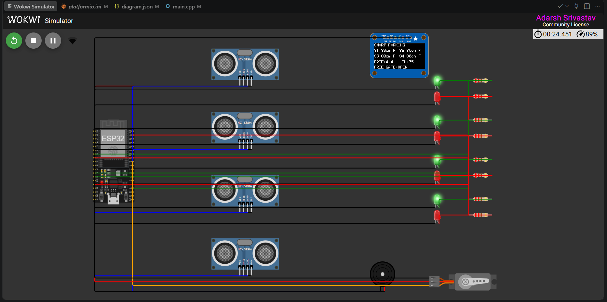

### 🚗 One Parking Slot Occupied

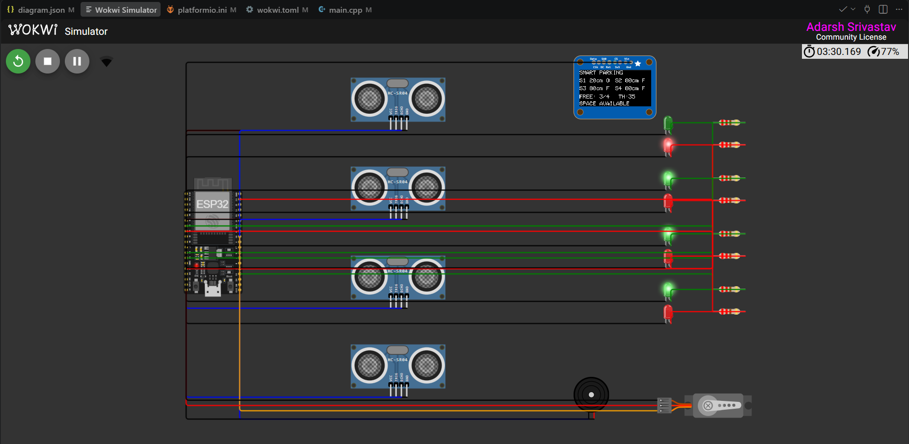

### 🚗🚗 Two Parking Slots Occupied


### 🚗🚗🚗 Three Parking Slots Occupied

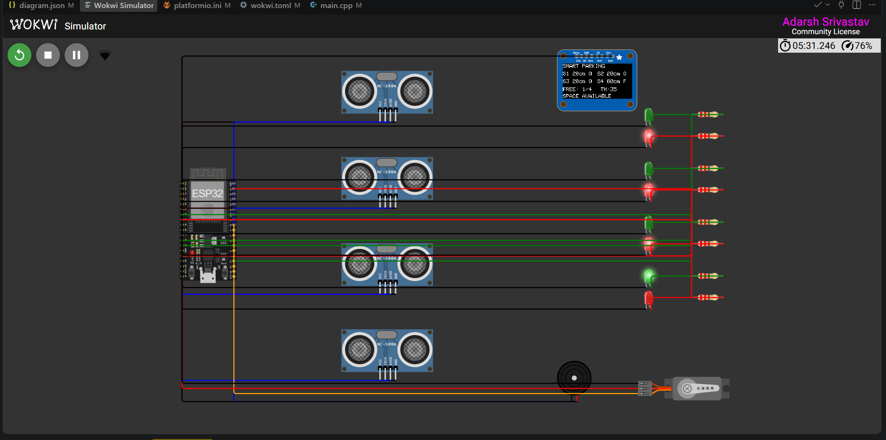

### 🚨 Parking Full

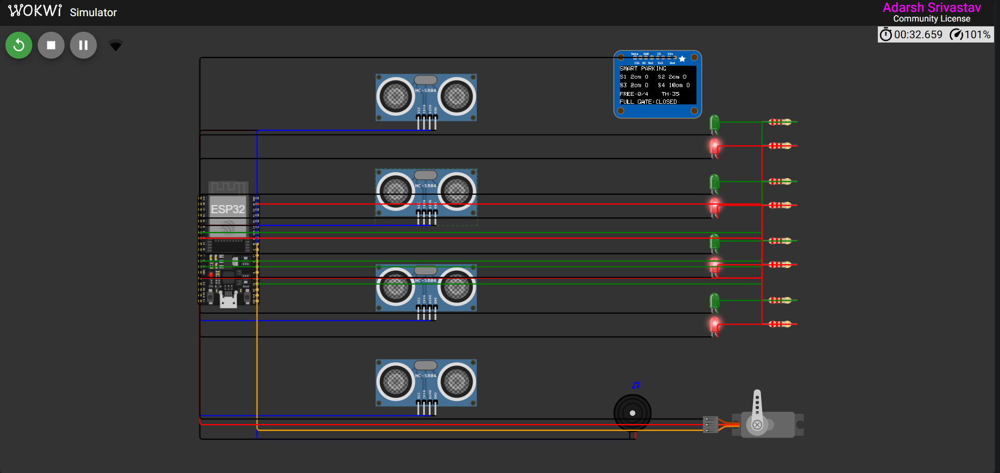

### 🚧 Servo Gate Reopen

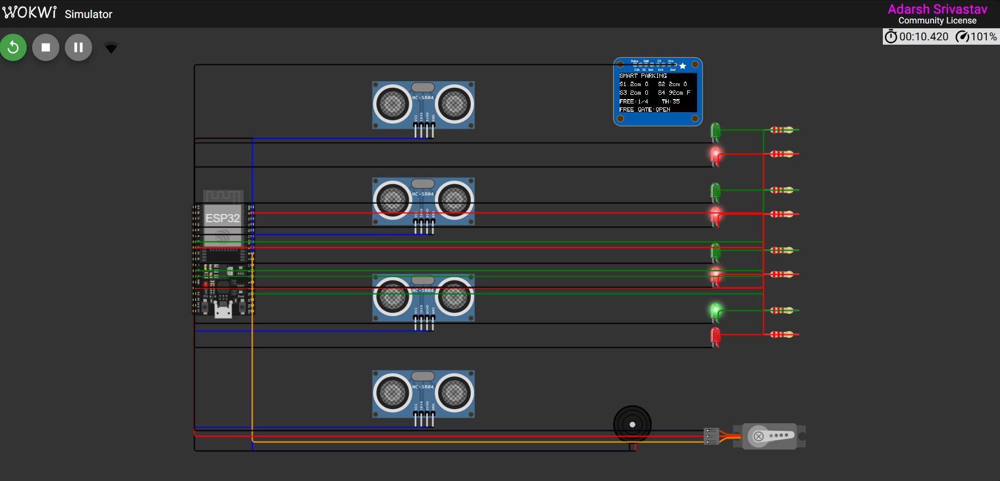

### 🖥️ OLED Distance and Status

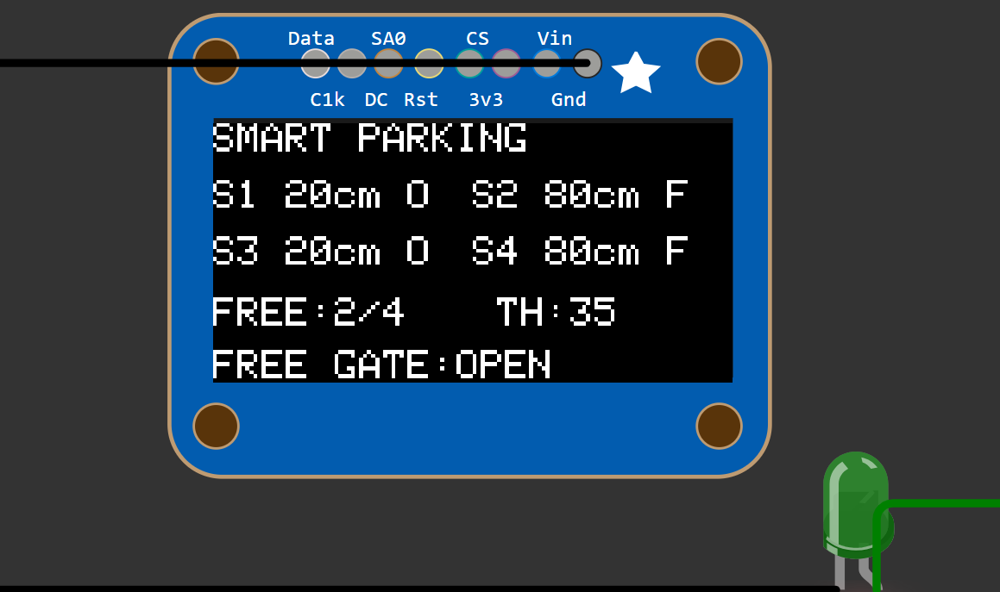

### 🟢 Green LED

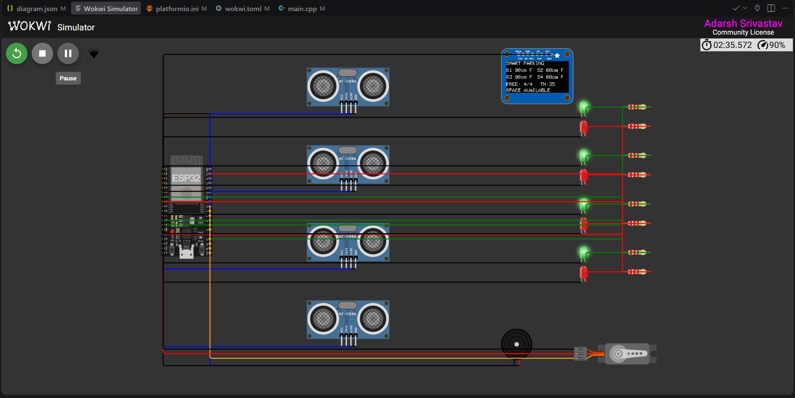

### 🔴 Red LED


### 🔊 Buzzer

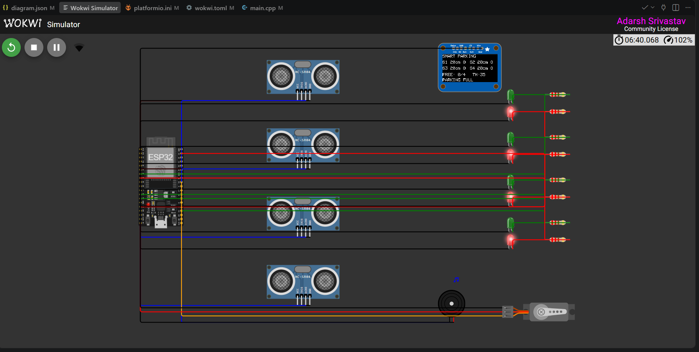

### 🌐 Web Dashboard — All Free

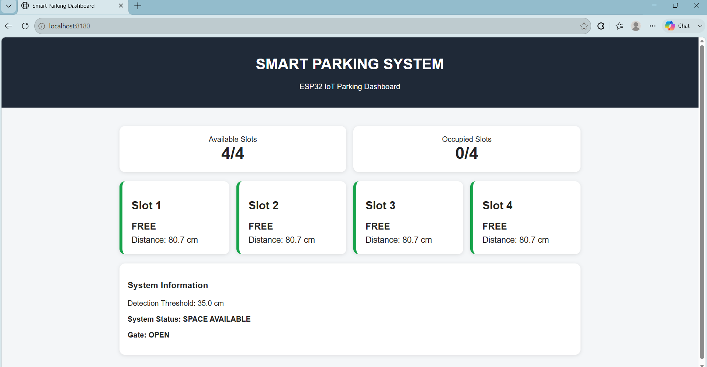

### 🌐 Web Dashboard — Mixed State

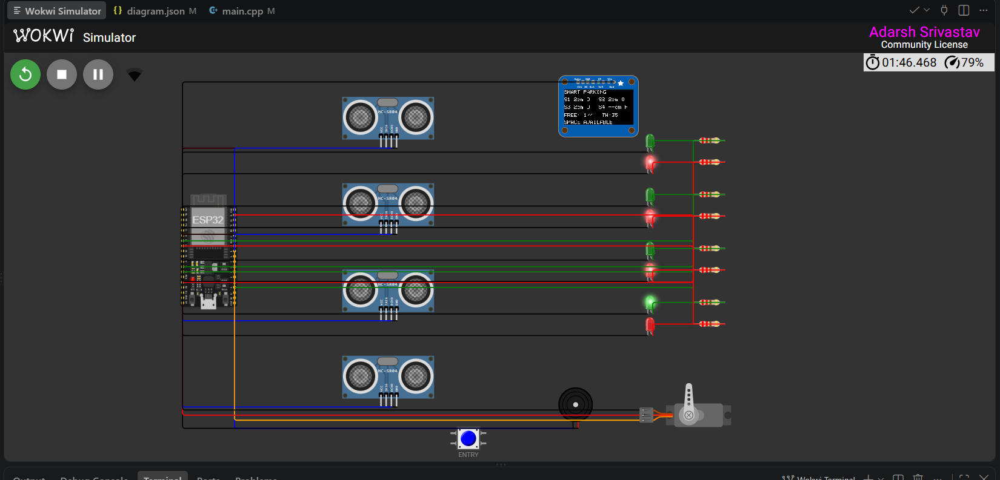

### 🌐 Web Dashboard — Full

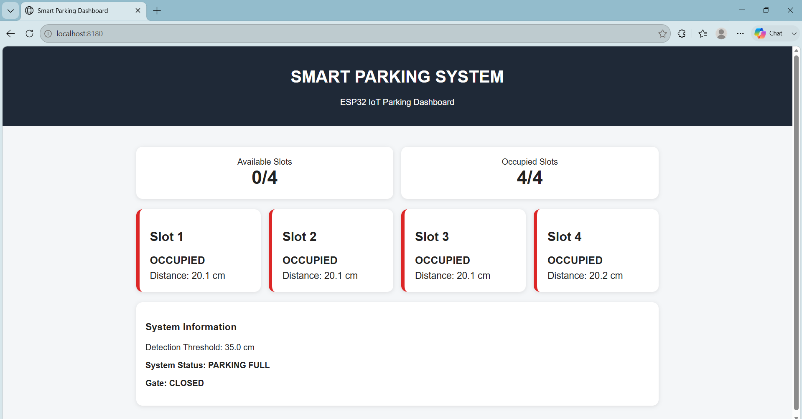

---

## 📁 Project Structure

```text
Smart-Parking-Ultrasonic-Sensor-System/
│
├── .gitignore
├── README.md
├── PROJECT.md
├── platformio.ini
├── diagram.json
├── wokwi.toml
│
├── src/
│   └── main.cpp
│
├── docs/
│   ├── algorithm.md
│   ├── architecture.md
│   ├── hardware.md
│   ├── pin_mapping.md
│   ├── simulation.md
│   ├── testing.md
│   └── troubleshooting.md
│
├── circuit_diagram/
│   └── README.md
│
├── simulation/
│   └── README.md
│
├── test_cases/
│   ├── README.md
│   └── test_cases.csv
│
├── data/
│   └── sample_sensor_data.csv
│
├── outputs/
│   ├── final_result.txt
│   ├── parking_status.txt
│   ├── serial_output.txt
│   └── test_results.csv
│
├── reports/
│   └── project_report.md
│
└── screenshots/
    ├── README.md
    └── validation evidence
```

---

## 🛠️ Implementation Workflow

```text
Project Planning
      ↓
System Architecture
      ↓
Pin Mapping
      ↓
Circuit Design
      ↓
Single Sensor Validation
      ↓
FREE/OCCUPIED Detection
      ↓
Four-Slot Integration
      ↓
Available Slot Counter
      ↓
OLED Integration
      ↓
LED Indication
      ↓
Buzzer Alert
      ↓
Servo Integration
      ↓
Web Dashboard
      ↓
Wokwi Simulation
      ↓
Testing & Validation
      ↓
Documentation
      ↓
GitHub Deployment
```

---

## ▶️ How to Run the Project

### Wokwi Simulation

1. Open the project in VS Code.
2. Open the configured Wokwi simulation.
3. Build the project using PlatformIO.
4. Start the simulation.
5. Select an HC-SR04 sensor.
6. Change its simulated distance.
7. Observe the Serial Monitor.
8. Observe the OLED, LEDs, buzzer, and servo.
9. Open the dashboard at `http://localhost:8180`.

### VS Code + PlatformIO

1. Clone the repository.
2. Open the project folder in VS Code.
3. Install the PlatformIO extension.
4. Verify the `esp32dev` environment.
5. Build the project.
6. Start Wokwi for virtual validation.
7. Open the PlatformIO Serial Monitor or Wokwi serial terminal.
8. Use the configured Wokwi/network interface for dashboard testing.

> Physical upload instructions apply only when real ESP32 hardware is available. The current project has been validated virtually.

---

## 📈 Results

The implemented virtual prototype demonstrates:

- Four-slot parking detection.
- Ultrasonic distance measurement.
- FREE/OCCUPIED classification.
- Available-slot counting.
- OLED status display.
- Individual green/red LED indication.
- Parking-full buzzer alert.
- Capacity-based servo gate.
- ESP32 Wi-Fi connectivity.
- Browser-based HTTP dashboard.
- Serial debugging.
- Wokwi virtual validation.

The project should be described as a **functional virtual prototype**, not as a physically validated production system.

---

## 🌐 Applications

The architecture can be adapted for:

- Shopping mall parking
- Hospital parking
- University and campus parking
- Office parking
- Residential parking
- Railway station parking
- Smart-city parking
- Small automated parking facilities

---

## ✅ Advantages

- Real-time parking monitoring
- Automated slot detection
- Multiple local indicators
- Browser-based monitoring
- Low-cost prototype architecture
- Clear embedded decision logic
- Expandable slot architecture
- Suitable for IoT extension
- Fully reproducible virtual simulation
- Professional testing and documentation structure

---

## ⚠️ Limitations

- Current prototype supports four parking slots.
- Ultrasonic readings depend on sensor placement.
- Physical deployment requires threshold calibration.
- Physical hardware validation has not been performed.
- No cloud backend is implemented.
- No mobile application is implemented.
- No RFID is implemented.
- No license-plate recognition is implemented.
- No reservation or payment system is implemented.
- The servo is capacity-based and does not independently detect vehicle arrival.
- Production-grade security is not implemented.

---

## 🚀 Future Scope

The project can be extended with:

- ESP32 multi-node parking networks
- MQTT or cloud connectivity
- Mobile application
- Centralized web dashboard
- Historical parking analytics
- Individual smart gate control
- Dedicated entry and exit sensors
- RFID-based vehicle identification
- License-plate recognition
- Online parking reservation
- Digital payment integration
- Database-backed parking history
- Multi-floor parking management
- Smart-city parking integration
- Notifications and alerts

---

## 🎓 Skills Demonstrated

### Embedded Systems

- ESP32 programming
- GPIO interfacing
- Ultrasonic sensing
- Timing and pulse measurement
- State management
- Real-time control

### Electronics

- HC-SR04 interfacing
- I²C communication
- OLED interfacing
- LED control
- Buzzer control
- Servo/PWM control

### Programming

- C/C++
- Functions
- Arrays
- Conditional logic
- Sensor-data processing
- Serial communication
- State-based control

### IoT

- ESP32 Wi-Fi
- HTTP
- Embedded web server
- Browser-based dashboard

### Tools

- Visual Studio Code
- PlatformIO
- Wokwi
- Git
- GitHub

---

## 💼 Industry Relevance

This project demonstrates an end-to-end embedded development workflow:

```text
Requirements
      ↓
Architecture
      ↓
Hardware Mapping
      ↓
Firmware
      ↓
Sensor Processing
      ↓
Decision Logic
      ↓
Local Interface
      ↓
Actuation
      ↓
IoT Dashboard
      ↓
Testing
      ↓
Documentation
      ↓
Version Control
```

The architecture provides a foundation for larger parking, access-control, monitoring, and smart-city IoT systems.

---

## 📚 Documentation

Detailed technical documentation is available in:

```text
docs/
├── algorithm.md
├── architecture.md
├── hardware.md
├── pin_mapping.md
├── simulation.md
├── testing.md
└── troubleshooting.md
```

Additional project documentation:

```text
PROJECT.md
circuit_diagram/README.md
simulation/README.md
test_cases/README.md
reports/project_report.md
```

Project evidence and outputs:

```text
screenshots/
outputs/
data/
test_cases/
reports/
```

---

## 🔬 Project Status

### ✅ Functional Virtual Prototype

The four-slot Smart Parking System has been implemented and validated virtually using **Wokwi** and **PlatformIO**.

The project demonstrates:

- Parking-slot detection
- Available-slot counting
- OLED visualization
- LED indication
- Parking-full alert
- Capacity-based servo gate
- ESP32 web dashboard
- Serial debugging
- Structured testing and evidence

> **Physical hardware validation has not been performed.**

---

## 👨‍🎓 Author

**Adarsh Srivastav**

Computer Science and Engineering (CSE) Student

**Areas of Interest:**  
Embedded Systems | IoT | Python | AI

---

## ⭐ Conclusion

The **Smart Parking System Using Ultrasonic Sensors** demonstrates how ultrasonic sensing, embedded control, local interfaces, actuator control, and IoT networking can be integrated into a practical parking-management prototype.

The complete workflow is:

```text
SENSING
   ↓
DISTANCE PROCESSING
   ↓
PARKING DECISION
   ↓
AVAILABILITY COUNT
   ↓
OLED + LEDs + BUZZER
   ↓
SERVO GATE
   ↓
ESP32 WEB DASHBOARD
```

The virtual implementation provides a reproducible proof of concept that can be further extended into a physical and cloud-connected smart parking platform with dedicated entry/exit detection, authentication, reservations, payments, analytics, and smart-city integration.

---

## ⭐ Project Highlights

```text
4 Parking Slots
4 HC-SR04 Ultrasonic Sensors
ESP32 DevKit
35 cm Detection Threshold
SSD1306 OLED
4 Green LEDs
4 Red LEDs
Buzzer
SG90 Servo
ESP32 Wi-Fi
HTTP Web Dashboard
Wokwi Simulation
PlatformIO
Embedded C/C++
Git & GitHub
```

---

**Project Status: ✅ Functional Virtual Prototype | 🧪 Validated in Wokwi | 🚀 Ready for GitHub**
